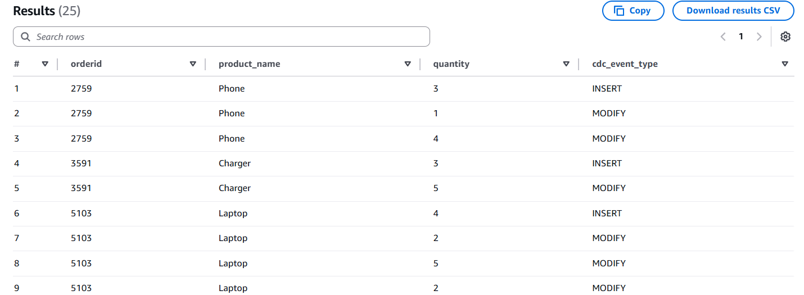

# 📦 CDC Data Pipeline for Gadgets Sales Analysis

This project demonstrates a **real-time Change Data Capture (CDC) data pipeline** built on AWS to process, transform, and analyze sales data for electronic gadgets.

---

## 🚀 Overview

The system simulates real-world e-commerce sales using a Python-based mock data generator that writes to **DynamoDB**. Any changes (INSERT/MODIFY/REMOVE) in the table are captured and streamed via an **EventBridge Pipe** to **Kinesis Data Streams**, then transformed using **AWS Lambda**, stored in **Amazon S3**, cataloged using **AWS Glue**, and finally queried using **Amazon Athena**.

---

## 🧩 Architecture Diagram


---

## 🛠️ Components Used

| Component              | Purpose |
|------------------------|---------|
|  Python Script        | Simulates mock gadget sales and writes to DynamoDB |
|  DynamoDB            | Stores sales orders as raw data |
|  EventBridge Pipe     | Listens to DynamoDB stream and routes events to Kinesis |
|  Kinesis Data Stream | Acts as a buffer to handle streaming data |
|  Kinesis Firehose     | Triggers Lambda and delivers transformed data to S3 |
|  Lambda Function     | Transforms and flattens the raw CDC records |
|  Amazon S3           | Stores the transformed data in newline-delimited JSON format |
|  AWS Glue            | Crawls and catalogs the transformed data |
|  Amazon Athena       | Enables querying the data using standard SQL |

---

## 🔁 Data Pipeline
---
### Python script
To simulate a real-world e-commerce environment, we created a Python script that generates **random gadget orders** and writes them into a DynamoDB table. Each order contains details like:

```python
def generate_new_order():
    orderid = str(random.randint(1000, 9999))
    product_name = random.choice(PRODUCTS)
    quantity = random.randint(1, 5)
    price = Decimal(str(round(random.uniform(10.0, 500.0), 2)))
    customer_id = str(random.randint(1000, 9999))
    payment_method = random.choice(PAYMENT_METHODS)
    timestamp = datetime.utcnow().isoformat() + 'Z'
    status = 'pending'

    return {
        'orderid': orderid,
        'product_name': product_name,
        'quantity': quantity,
        'price': price,
        'customer_id': customer_id,
        'payment_method': payment_method,
        'timestamp': timestamp,
        'status': status
    }
```

---
### DynamoDB & Change Data Capture (CDC)
Amazon DynamoDB is used to store the gadget sales data. It’s a fast and scalable NoSQL database that supports real-time applications.

To track any changes made to the data, DynamoDB Streams is enabled. This allows us to capture every INSERT, MODIFY, or REMOVE operation made to the table.

📘 What is CDC?
Change Data Capture (CDC) is a pattern used to capture and record changes in a data source. In this pipeline, CDC allows us to:

- Track real-time changes in orders
- Stream them to downstream services like Kinesis
- Build near real-time analytics dashboards

---
### EventBridge Pipe – Connecting Source to Target
To route changes from DynamoDB to Kinesis, we use Amazon EventBridge Pipes.

🎯 Configuration:
Source: DynamoDB Stream
Target: Kinesis Data Stream


---
### Kinesis Data Streams to Firehose

The data captured by EventBridge Pipes is pushed to a Kinesis Data Stream, which temporarily buffers the events in shards for reliable delivery.
We then connect Kinesis Data Stream → Kinesis Firehose, which is responsible for:
- Invoking a Lambda function for transformation
- Delivering the transformed output to Amazon S3

---
###  Lambda Transformation
The Lambda function performs transformations on the CDC records such as:
- Flattening the nested structure
- Extracting values from NewImage
- Adding derived fields like total_price
- Encoding the output in newline-delimited JSON format.

```python
    for record in event['records']:
        try:
            # Decode base64 record data
            payload = base64.b64decode(record['data'])
            data = json.loads(payload)

            # Check for supported CDC event type
            event_name = data.get('eventName')
            if event_name not in ['INSERT', 'MODIFY']:
                    output.append({
                        'recordId': record['recordId'],
                        'result': 'Dropped',
                        'data': record['data']
                    })
                    continue

            # Extract and flatten NewImage
            new_image = data['dynamodb']['NewImage']
            transformed_data = {
                'orderid': new_image['orderid']['S'],
                'product_name': new_image['product_name']['S'],
                'quantity': int(new_image['quantity']['N']),
                'price': float(new_image['price']['N']),
                'customer_id': new_image['customer_id']['S'],
                'payment_method': new_image['payment_method']['S'],
                'status': new_image['status']['S'],
                'order_timestamp': new_image['timestamp']['S'],
                'cdc_event_type': event_name,
                'total_price': round(float(new_image['price']['N']) * int(new_image['quantity']['N']), 2)
            }

            # Convert the transformed data to a JSON string and then encode it as base64
            transformed_data_str = json.dumps(transformed_data) + '\n'
            transformed_data_encoded = base64.b64encode(transformed_data_str.encode('utf-8')).decode('utf-8')

            # Append the transformed record to the output using 'eventID' as 'recordId'
            output.append({
                'recordId': record['recordId'],
                'result': 'Ok',
                'data': transformed_data_encoded
            })
```

Only INSERT and MODIFY events are processed — REMOVE is dropped.

Once the data is transformed by the Lambda function, it is delivered to an **Amazon S3 bucket** using **Kinesis Data Firehose**.


---
### AWS Glue Catalog

To make the data queryable, we use **AWS Glue** to catalog it:

- A **Glue Crawler** scans the S3 bucket and detects the schema.
- It automatically creates or updates a **table in the Glue Data Catalog**.
- The crawler uses a **JSON classifier**, with a defined JSONPath to extract fields from the documents.

Once cataloged, this structured metadata can be directly queried using Amazon Athena.

----
### Athena
Using **Amazon Athena**, we can write standard **SQL queries** to explore the sales data, such as:

- Viewing all new orders
- Filtering orders by status
- Grouping and aggregating sales by product or customer
- Identifying orders that were modified multiple times (via CDC event types)
  
#### 🧾 Sample Query and Output
This query identifies `orderid`s that were first **INSERTED** and later **MODIFIED** in the data captured from the DynamoDB stream.

#### 📄 Query


#### 📊 Output




The output highlights `orderid`s that have undergone multiple CDC events, such as an initial **INSERT** followed by a **MODIFY**, demonstrating how change history can be tracked in the pipeline

---

## 📌 Note

Ensure that:
- The Lambda function handles `base64` encoding/decoding properly
- Proper IAM permissions are configured for EventBridge, Firehose, Lambda, and Glue
- Timestamps are in a consistent format for Athena queries
